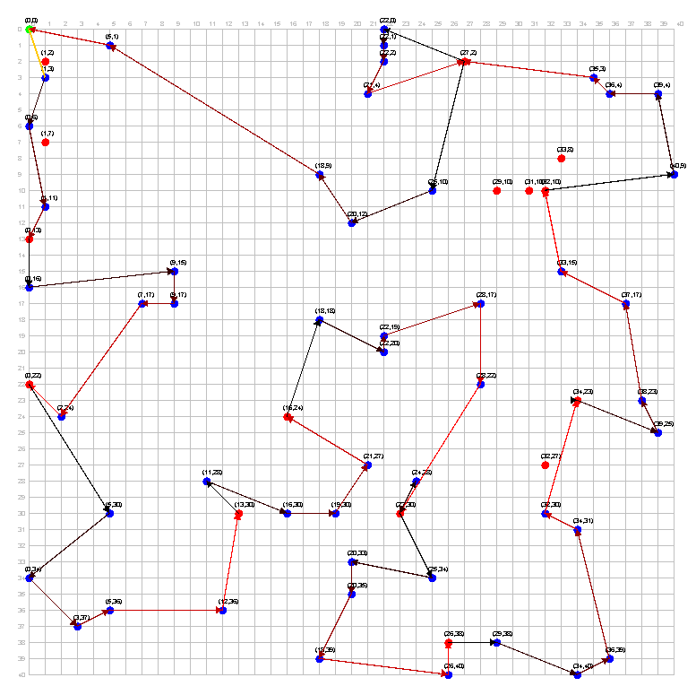

# Ottimizzazione del Percorso di un Braccio Robotico



Un'applicazione Java che ottimizza il percorso di un braccio robotico che esegue operazioni su una scheda elettronica utilizzando algoritmi euristici come **Tabu Search**, **Greedy**, **2-opt** e **PSO**. L'obiettivo è minimizzare la distanza totale percorsa rispettando i vincoli sulle operazioni consecutive.

## Funzionalità

- **Algoritmi Multipli**:
    - Tabu Search
    - Greedy
    - 2-opt
    - Particle Swarm Optimization (PSO)

- **Visualizzatore**:
    - Zoom e trascinamento della scheda
    - Percorsi colorati (nero → rosso → viola in base alle operazioni consecutive)
    - Punti di reset (rossi) e punti di operazione (blu)

- **Configurazione Dinamica**:
    - Penalità regolabile per soluzioni non ammissibili
    - Parametri configurabili per la Tabu Search
    - Dimensioni personalizzabili della scheda e punti di operazione/reset

## Installazione

1. **Prerequisiti**:
    - Java 8 o superiore
    - Maven

2. **Clona il Repository**:
   ```bash
   git clone https://github.com/FedericoChiodi/OR_TSP-W-Resets.git
   cd OR_TSP-W-Resets
   ```
3. **Compila ed esegui**
    ```bash
    mvn clean package
    java -jar target/OR_TSP-W-Resets.jar
    ```

## Configurazione
Modifica src/main/java/org/sanpc/Constants.java

## Riconoscimenti
Realizzato per l'esame di ricerca operativa @ UniFE - 2025